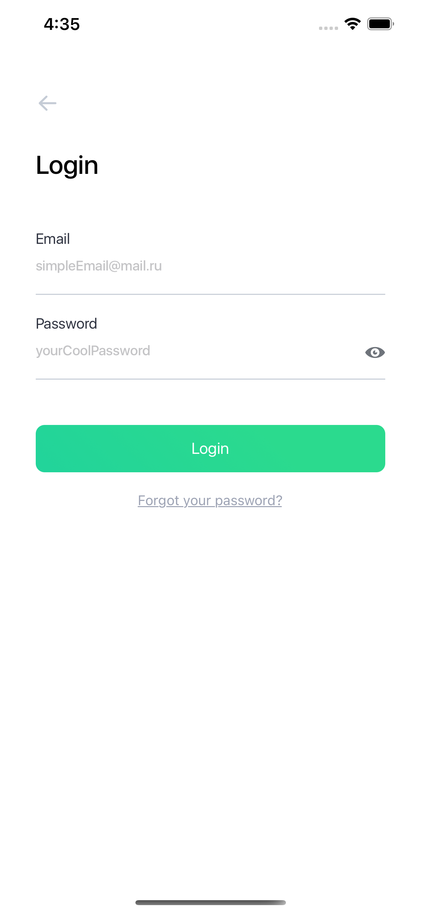
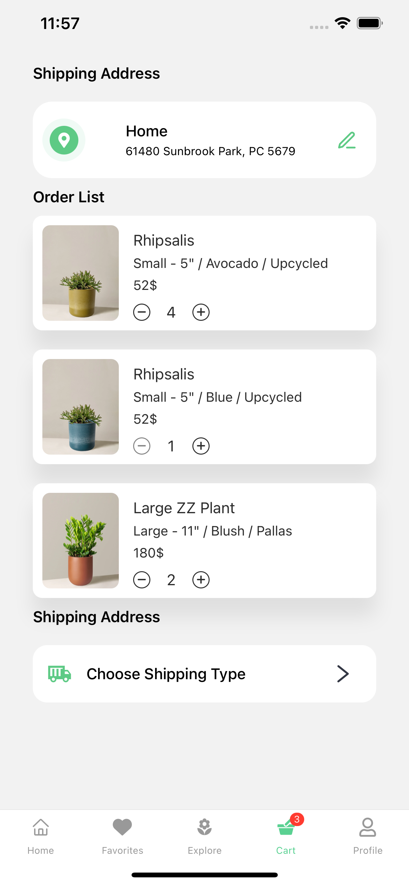
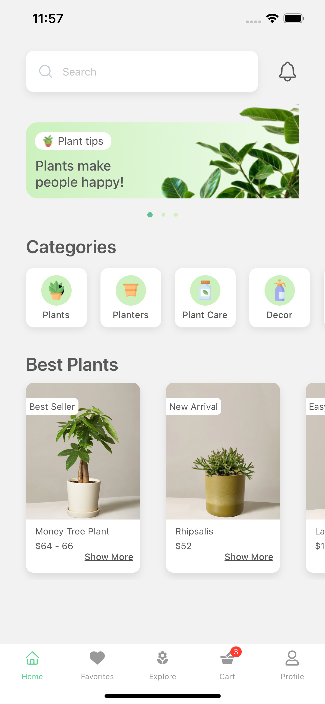

# Greener-ReactNative Plants App

## Introduction

> A creative and modern clothes shopping app design for react-native using the native-base UI components.
It works well with both IOS and Android.


Welcome Page            |  SignIn Page           |  SignUp Page |  Password Recovery
:-------------------------:|:-------------------------:|:-------------------------:|:-------------------------:
  |     |    |   

Side Menu          |  Browser         |  Explore    |  Best Plants       |  Settings
:-------------------------:|:-------------------------:|:-------------------------:|:-------------------------: |:-------------------------:
  |     |    |    |   

## Availables pages

> This is the list of the availables pages with this source code:

* [Welcome Page](./src/screens/HomeScreen.tsx)
* [SignIn Page](./src/screens/LoginScreen.tsx)
* [SignUp Page](./src/screens/SignUpScreen.tsx)
* [Password Recovery](./src/screens/ForgotPasswordScreen.tsx)
* [Side Menu](./src/navigation/CustomDrawer.tsx)
* [Browser](./src/screens/BrowseScreen.tsx)
* [Explore](./src/screens/ExploreScreen.tsx)
* [Best Plants](./src/screens/BestPlantsScreen.tsx)
* [Settings](./src/screens/SettingsScreen.tsx)


## Installation

> Follow these steps to install and test the app:

```
git clone https://github.com/Dmitry-savenkov/Greener.git
yarn
yarn start
```