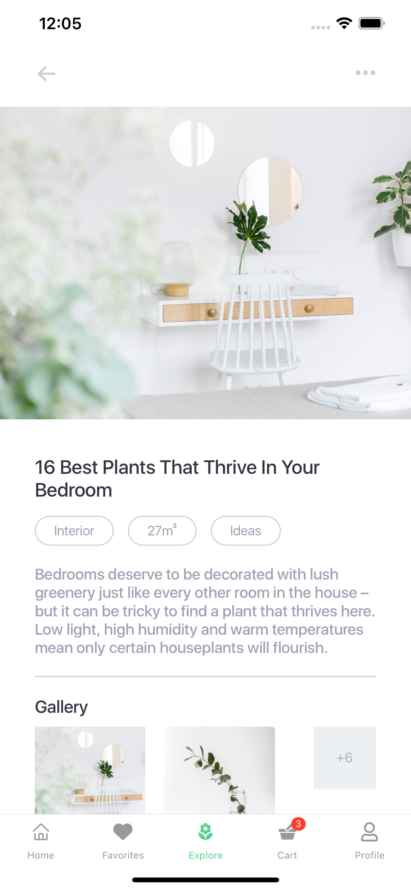
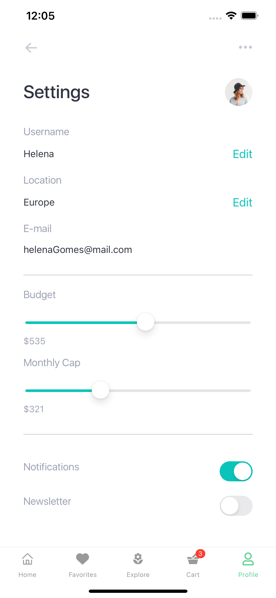

# Greener-ReactNative Plants App

## Introduction

> A creative and modern plants app design for react-native using the expo and native-base UI components.
It works well with both IOS and Android.


Welcome Page            |  SignIn Page           |  SignUp Page |  Password Recovery
:-------------------------:|:-------------------------:|:-------------------------:|:-------------------------:
  |     |    |   

Home          |  Favorites         |  Explore    |  Cart       |  Profile
:-------------------------:|:-------------------------:|:-------------------------:|:-------------------------: |:-------------------------:
  |     |    |    |   

## Availables pages

> This is the list of the availables pages with this source code:

* [Welcome Page](./src/screens/WelcomeScreen.tsx)
* [SignIn Page](./src/screens/LoginScreen.tsx)
* [SignUp Page](./src/screens/SignUpScreen.tsx)
* [Password Recovery](./src/screens/ForgotPasswordScreen.tsx)
* [Side Menu](./src/navigation/CustomDrawer.tsx)
* [Browser](./src/screens/HomeScreen.tsx)
* [Explore](./src/screens/FavoritesScreen.tsx)
* [Best Plants](./src/screens/BestPlantsScreen.tsx)
* [Settings](./src/screens/ProfileScreen.tsx)


## Installation

> Follow these steps to install and test the app:

```
git clone https://github.com/Dmitry-savenkov/Greener.git
```

In order to run the project, you need to first create a `env.ts` file in the root of the project.

```
const API_KEY = 'your_api_key';
const AUTH_DOMAIN = 'your_auth_domain';
const PROJECT_ID = 'your_project_id';
const STORAGE_BUCKET = 'your_storage_bucket';
const MESSAGING_SENDER_ID = 'your_messaging';
const APP_ID = 'your_app_id';
export { API_KEY, AUTH_DOMAIN, PROJECT_ID, STORAGE_BUCKET, MESSAGING_SENDER_ID, APP_ID };

```

The keys is a private firebase keys. To generate this keys [visit this link](https://console.firebase.google.com) and create project with auth

```
npm i
expo start / yarn start
```
